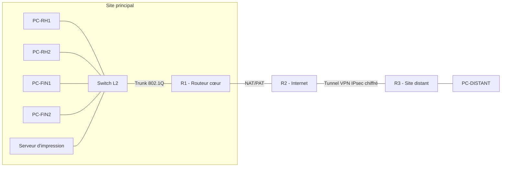

# Réseau d'Entreprise Sécurisé — VLAN, ACL, NAT & VPN Site-à-Site (Cisco Packet Tracer)

**Mots-clés :** Cybersécurité réseau · Sécurité des systèmes d'information (SSI) · Segmentation réseau · Contrôle d'accès (Access Control) · VLAN · ACL · NAT/PAT · VPN IPsec · Défense en profondeur · Cisco IOS · Routage inter-VLAN · GRC (Gouvernance, Risque, Conformité)

## Contexte et objectifs

Ce projet simule l'architecture réseau sécurisée d'une entreprise avec deux services internes (RH et Finance) et un site distant, en appliquant des principes de **sécurité par conception (security by design)** et de **défense en profondeur** : segmentation logique, contrôle d'accès strict avec exception métier justifiée, traduction d'adresses vers l'extérieur, et chiffrement des communications inter-sites.

L'objectif n'était pas seulement de faire fonctionner le réseau, mais de justifier chaque choix de sécurité comme le ferait un consultant face à un client : pourquoi cette segmentation, pourquoi cette règle d'accès précise plutôt qu'un blocage total, comment vérifier qu'une mesure de sécurité fonctionne réellement.

## Architecture



**Plan d'adressage :**

| Segment | Réseau | Rôle |
|---|---|---|
| VLAN 10 (RH) | 10.10.10.0/24 | Poste utilisateurs RH |
| VLAN 20 (Finance) | 10.10.20.0/24 | Poste utilisateurs Finance + serveur d'impression |
| Lien R1 – R2 | 203.0.113.0/30 | Interconnexion vers "Internet" |
| Lien R2 – R3 | 203.0.113.8/30 | Interconnexion vers le site distant |
| LAN site distant | 10.10.30.0/24 | Poste utilisateur du site distant |

## Mesures de sécurité mises en œuvre

### 1. Segmentation réseau (VLAN + routage inter-VLAN)
Séparation logique des services RH et Finance sur des VLAN distincts, avec routage inter-VLAN centralisé sur R1 (router-on-a-stick) — un point de contrôle unique et auditable entre les deux services.

### 2. Contrôle d'accès par exception ciblée (ACL)
Plutôt qu'un blocage total entre RH et Finance, une **ACL étendue avec exception métier justifiée** autorise uniquement RH à joindre le serveur d'impression partagé, et bloque tout autre accès vers Finance :
```
access-list 110 permit ip 10.10.10.0 0.0.0.255 host 10.10.20.10
access-list 110 deny ip 10.10.10.0 0.0.0.255 10.10.20.0 0.0.0.255
access-list 110 permit ip any any
```

### 3. Traduction d'adresses (NAT/PAT)
Le trafic sortant vers "Internet" est traduit et masqué derrière une adresse publique unique (PAT/overload), limitant l'exposition directe des postes internes.

**Preuve de fonctionnement (`show ip nat translations`) :**
```
Pro Inside global      Inside local       Outside local     Outside global
icmp 203.0.113.1:21    10.10.10.11:21     203.0.113.2:21    203.0.113.2:21
icmp 203.0.113.1:22    10.10.10.11:22     203.0.113.2:22    203.0.113.2:22
icmp 203.0.113.1:23    10.10.10.11:23     203.0.113.2:23    203.0.113.2:23
icmp 203.0.113.1:24    10.10.10.11:24     203.0.113.2:24    203.0.113.2:24
```

### 4. Chiffrement des communications inter-sites (VPN IPsec site-à-site)
Un tunnel VPN IPsec (IKE/ISAKMP + ESP AES-256) chiffre l'ensemble du trafic entre le site principal et le site distant, avec une ACL de trafic dédiée exclue du NAT pour préserver l'intégrité du tunnel.

**Preuve du tunnel actif (`show crypto isakmp sa`) :**
```
dst           src           state    conn-id slot status
203.0.113.10  203.0.113.1   QM_IDLE  1071    0    ACTIVE
```

**Preuve du chiffrement effectif (`show crypto ipsec sa`) :
**
```
local ident (addr/mask/prot/port): (10.10.10.0/255.255.255.0/0/0)
remote ident (addr/mask/prot/port): (10.10.30.0/255.255.255.0/0/0)
current_peer 203.0.113.10 port 500
#pkts encaps: 7, #pkts encrypt: 7
#pkts decaps: 6, #pkts decrypt: 6
```
## Validation

| Test | Résultat attendu | Résultat obtenu |
|---|---|---|
| PC-RH1 → passerelle VLAN | Succès | ✅ |
| PC-RH1 → PC-RH2 (même VLAN) | Succès | ✅ |
| PC-RH1 → Serveur d'impression (exception ACL) | Succès | ✅ |
| PC-RH1 → PC-FIN1 (bloqué par ACL) | Échec | ✅ (Request timed out) |
| PC-RH1 → 203.0.113.2 (NAT) | Succès, IP traduite | ✅ |
| PC-RH1 → PC-DISTANT (via VPN) | Succès après négociation IKE | ✅ (0% perte après établissement du tunnel) |

## Compétences démontrées

- Conception d'une architecture réseau segmentée orientée sécurité
- Rédaction et priorisation de règles de contrôle d'accès (ACL) avec logique d'exception métier
- Configuration et vérification de NAT/PAT
- Déploiement et validation d'un tunnel VPN IPsec site-à-site (IKE Phase 1 & 2, ESP)
- Diagnostic méthodique de pannes réseau (câblage, VLAN, ACL, NAT) par isolement progressif du problème
- Documentation technique orientée preuve, réutilisable dans un contexte d'audit ou de mission de conseil

## Limites et pistes d'amélioration

- Authentification VPN par clé pré-partagée (PSK) : une évolution en environnement réel utiliserait des certificats (PKI) pour une authentification plus robuste.
- Pas de redondance (un seul routeur cœur, un seul lien par site) : une architecture de production ajouterait du HSRP/VRRP et des liens redondants.
- Pas de journalisation centralisée (SIEM) : à ajouter pour une supervision de sécurité complète.

---
*Projet réalisé dans le cadre de ma préparation à un poste de consultante GRC / cybersécurité, en complément de mes compétences en gestion des risques (ISO/IEC 27001, EBIOS Risk Manager) et en tests d'intrusion.*
